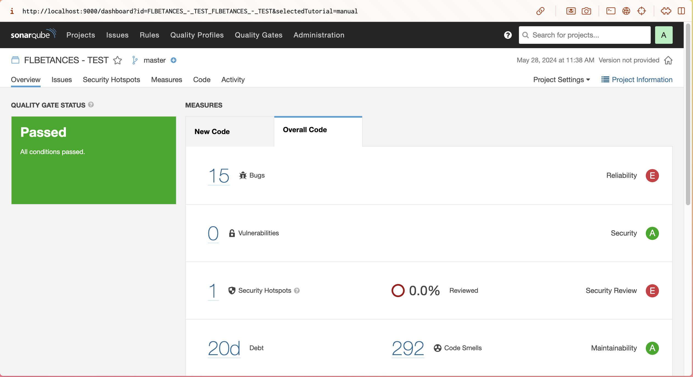
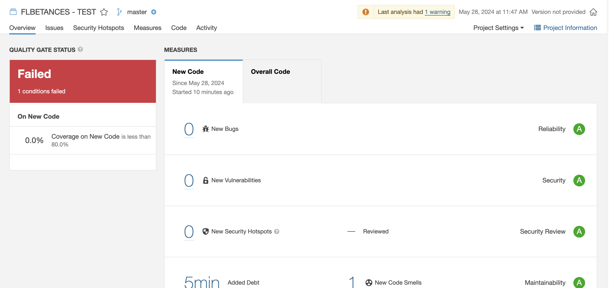
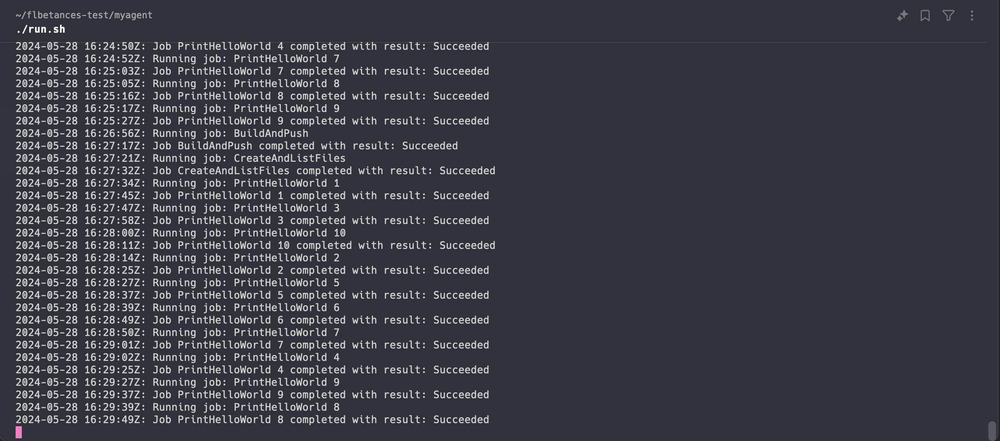
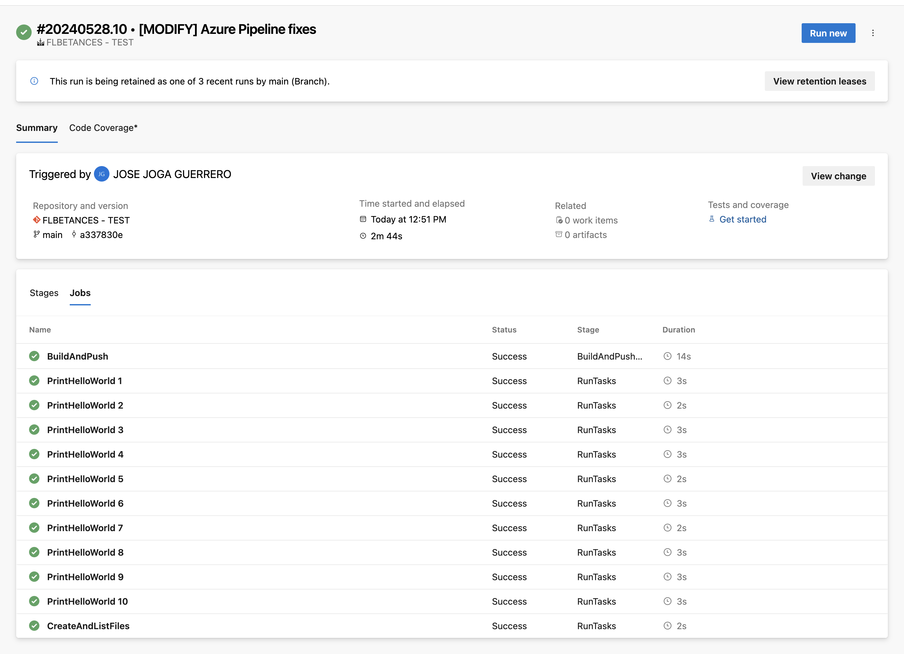

# Prueba-Dummy - Solución Camilo Joga

## Requisitos

Para completar esta prueba, se utilizaron las siguientes herramientas:

- SonarQube
- Organización en Azure DevOps
- Docker
- Azure Agent Pool SelfHosted
- Kubernetes (EKS)
- El getting-started image (node-todo-app) oficial de Docker

## Procedimiento

### 1. Descarga de archivos del repositorio elegido

Utilicé la aplicación todo-app de Node.js del repositorio "getting-started" de Docker. [Repositorio.](https://hub.docker.com/r/docker/getting-started)

### 2. Instalación del framework necesario

Ya tenía Node.js y npm instalados en mi máquina. Si no los tienes, instala Node.js desde [aquí](https://nodejs.org/).

o puedes instalarlo con Homebrew:

```bash
brew install node
brew install npm
```

### 3. Análisis y compilación de la aplicación con SonarQube

#### Instalación de SonarQube

Utilicé el repositorio [SonarqubeAppleM1](https://github.com/terry1921/SonarqubeAppleM1.git) para instalar SonarQube usando Docker en mi MacBook Pro M1.

#### Configuración de SonarQube

1. Inicié SonarQube usando Docker:

   ```bash
   cd SonarqubeAppleM1
   ```

   ```bash
   docker-compose up -d
   ```

2. Accedí a SonarQube en `http://localhost:9000` y configuré un nuevo proyecto.

#### Análisis de la aplicación

1. Configuré el proyecto en SonarQube y descargué el scanner de SonarQube.
2. En vez de utilizar el scanner.properties, ejecuté el analisis con el comando completo:

   ```bash
   sonar-scanner -Dsonar.projectKey=todo-app -Dsonar.sources=. -Dsonar.host.url=http://localhost:9000 -Dsonar.login=token
   ```

### 4. Escenarios de análisis

#### Análisis Exitoso

1. Realicé un análisis exitoso de la aplicación.



#### Análisis Fallido

1. Introduje fallos de duplicación y código no utilizado para que falle el análisis.



### 5. Generación de la imagen de Docker y subida a DockerHub

#### Configuración del pipeline en Azure DevOps

1. Creé una organización en Azure DevOps y un repositorio para subir los archivos.
2. Instalé el agente self-hosted en mi MacBook M1.



#### Pipeline YAML

1. Configuré el pipeline YAML para generar una imagen Docker y subirla a DockerHub:

```yaml
trigger:
  - main

pool:
  name: FLBETANCES - POOL
  vmImage: "ubuntu-latest"

stages:
  - stage: BuildAndPushDockerImage
    jobs:
      - job: BuildAndPush
        steps:
          - script: |
              echo "Docker login"
              echo $(DOCKER_PASSWORD) | docker login -u $(DOCKER_USERNAME) --password-stdin
              echo "Building Docker image"
              docker buildx build --platform linux/amd64 -t $(DOCKER_USERNAME)/flbetances-test:latest .
              echo "Pushing Docker image"
              docker push $(DOCKER_USERNAME)/flbetances-test:latest
            displayName: "Build and Push Docker Image"

  - stage: RunTasks
    jobs:
      - job: PrintHelloWorld
        strategy:
          parallel: 10
        steps:
          - script: |
              echo "Hola Mundo"
            displayName: "Print Hola Mundo"

      - job: CreateAndListFiles
        steps:
          - script: |
              for i in {1..10}; do
                date > file_$i.txt
                cat "file_$i.txt"
              done
            displayName: "Create and List Files"
```

2. Ejecuté el pipeline y generé la imagen Docker, que fue subida a DockerHub.



### 6. Despliegue de la aplicación en Kubernetes

#### Creación del Helm Chart

1. Creé un Helm Chart para desplegar la aplicación en un clúster de EKS en AWS.

```bash
helm create todo-app
```

2. Modifiqué los archivos `values.yaml`, `deployment.yaml`, `service.yaml` y `ingress.yaml` para que la aplicación se despliegue correctamente.

Vea la carpeta `/environment/flbetances-todo-chart` para los archivos YAML.

#### Despliegue en EKS

1. Ya tenía un clúster de EKS creado con Terraform personalizado.

2. Desplegué la aplicación usando Helm:

   ```bash
   helm install flbetances-todo-app ./environment/flbetances-todo-chart
   ```

3. Configuré un Ingress para que la aplicación sea accesible desde internet usando AWS Load Balancer Controller.

## Resultados

### Repositorio

- Código fuente de la aplicación.
- Archivos YAML de Kubernetes y Helm Chart.
- Pipeline YAML.
- Capturas de pantalla.

### Aplicación Final

La aplicación está hosteada en la siguiente URL: [https://flbetances-todo.cjoga.cloud](https://flbetances-todo.cjoga.cloud)

## Bonus

- Utilicé Helm como manejador de templates.
- Desplegué la aplicación en AWS EKS.
- La aplicación es accesible desde internet.
